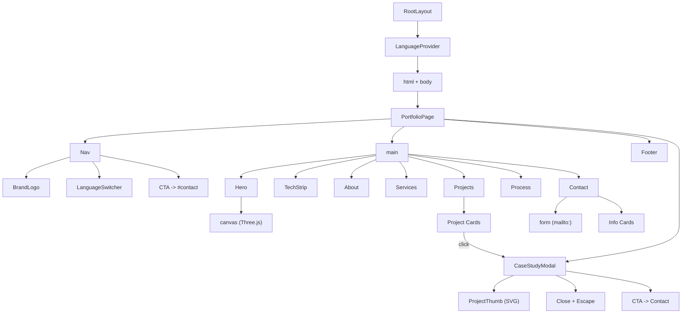
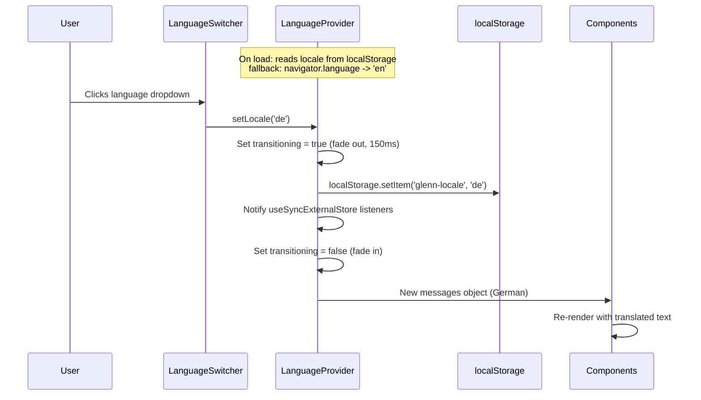
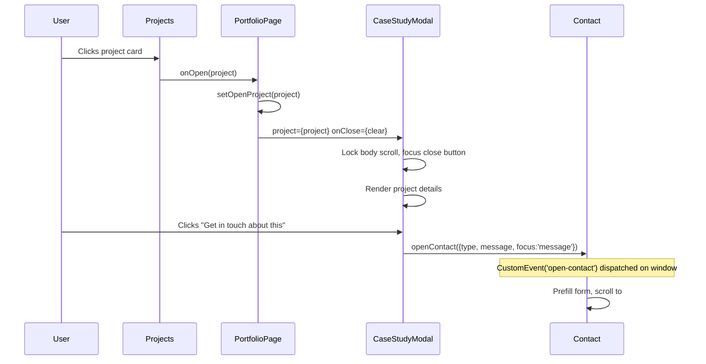
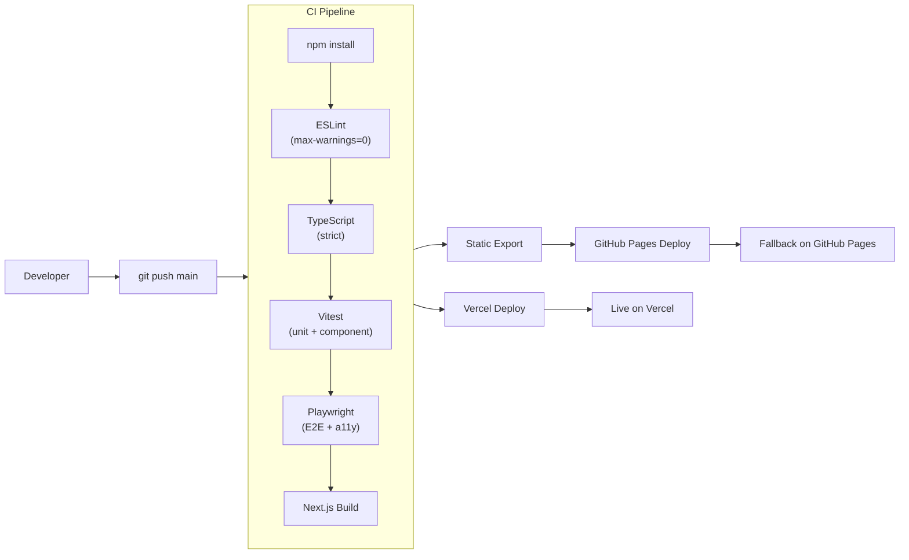
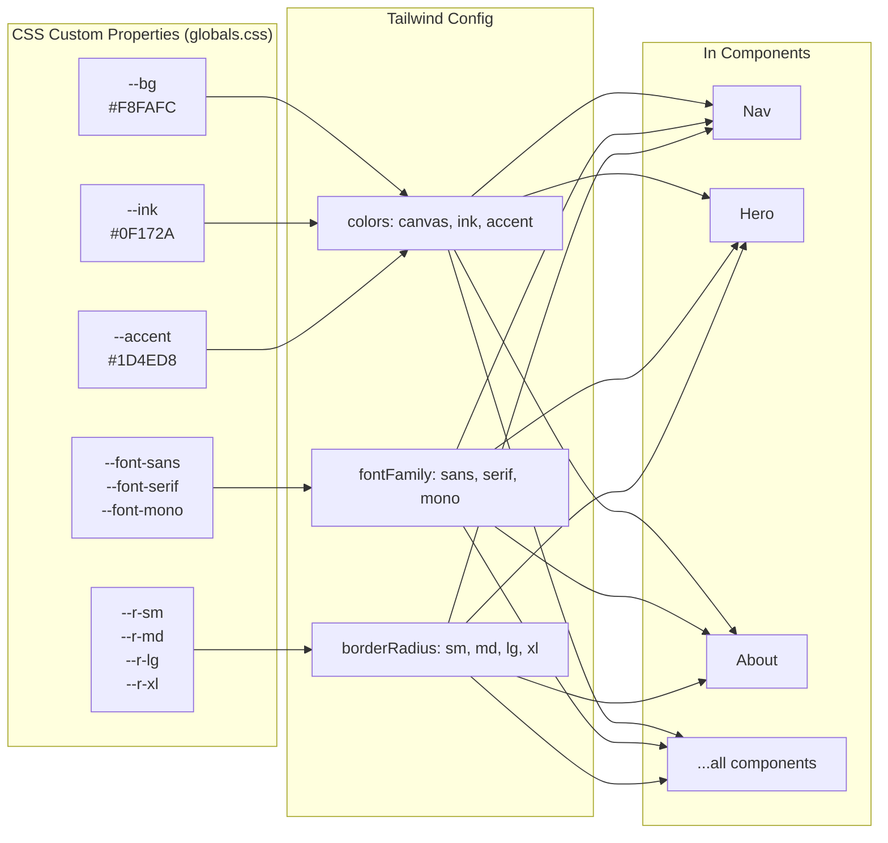
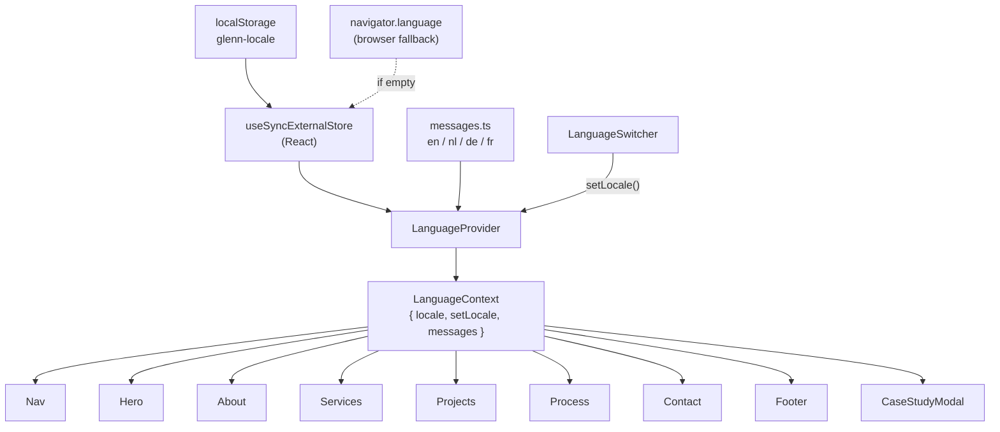

# Architecture Diagrams — Glenn Claes Portfolio

> Visual overview of the entire system. These diagrams render natively in JetBrains (WebStorm/IntelliJ), GitHub, VS Code with Mermaid extension, Notion, and most modern Markdown editors.

**Related:** [[architecture]] | [[components]] | [[app/api-reference/adapters/use-cases]]

---

## 1. System Overview

The big picture — how all the pieces connect, from the browser to deployment.

```mermaid
graph TB
    subgraph External["External"]
        Vercel["Vercel\n(Production)"]
        GH_Pages["GitHub Pages\n(Fallback)"]
        GH_Actions["GitHub Actions\n(CI/CD)"]
        GH_Repo["GitHub Repository"]
        Browser["Browser\n(Visitor)"]
    end

    subgraph Repo["Repository — frontend/"]
        direction TB
        APP["app/\nlayout + page + globals.css"]
        COMP["components/\n14 React components"]
        DATA["data/\nprojects.ts"]
        HOOKS["hooks/\nuseReveal"]
        I18N["i18n/\nmessages + LanguageProvider"]
        LIB["lib/\nhero-scene + navigation"]
    end

    subgraph Core["Runtime Architecture"]
        direction TB
        ROOT["RootLayout"]
        LANG["LanguageProvider\n(React Context)"]
        PAGE["PortfolioPage\n(Main Component)"]

        subgraph UI["UI Components"]
            NAV["Nav"]
            HERO["Hero"]
            TECH["TechStrip"]
            ABOUT["About"]
            SERVICES["Services"]
            PROJECTS["Projects"]
            PROCESS["Process"]
            CONTACT["Contact"]
            FOOTER["Footer"]
            MODAL["CaseStudyModal"]
        end

        subgraph Lib["Libraries"]
            SCENE["Three.js Scene\n(hero-scene.ts)"]
            REVEAL["useReveal Hook\n(IntersectionObserver)"]
            NAV_LIB["navigation.ts\n(jumpTo, openContact)"]
            PROJECT_DATA["getProjects(locale)\n(data/projects.ts)"]
        end
    end

    subgraph I18nSys["i18n System"]
        MSGS["messages.ts\nEN / NL / DE / FR"]
        LS["localStorage\n(glenn-locale)"]
        BROWSER_LANG["navigator.language\n(Fallback)"]
    end

    subgraph Testing["Quality Gates"]
        VITEST["Vitest\n(Unit + Component)"]
        PLAYWRIGHT["Playwright\n(E2E + a11y)"]
        ESLINT["ESLint\n(max-warnings=0)"]
        TSC["TypeScript\n(strict)"]
        PRETTIER["Prettier\n(formatting)"]
    end

    Browser -->|"visits"| Vercel
    Browser -->|"visits"| GH_Pages
    GH_Actions -->|"deploy"| Vercel
    GH_Actions -->|"static export"| GH_Pages
    GH_Repo -->|"push to main"| GH_Actions

    ROOT --> LANG
    LANG --> PAGE
    PAGE --> NAV & HERO & TECH & ABOUT & SERVICES & PROJECTS & PROCESS & CONTACT & FOOTER

    NAV --> NAV_LIB & LANG
    HERO --> SCENE & LANG
    ABOUT --> LANG
    SERVICES --> LANG
    PROJECTS --> LANG & PROJECT_DATA
    PROJECTS -->|"onOpen callback"| MODAL
    MODAL --> NAV_LIB & LANG
    PROCESS --> LANG & NAV_LIB
    CONTACT --> LANG
    CONTACT -->|"CustomEvent"| NAV_LIB
    FOOTER --> LANG & NAV_LIB

    LANG --> MSGS & LS
    LANG -.->|"fallback"| BROWSER_LANG
    PROJECT_DATA --> MSGS

    PAGE --> REVEAL

    GH_Actions --> VITEST & PLAYWRIGHT & ESLINT & TSC & PRETTIER
```

---

## 2. Component Render Tree

How the React component tree is structured — who renders whom.

---

## 3. Data Flow — Language Switch

What happens when a user picks a different language.

---

## 4. Data Flow — Project Modal

What happens when a user clicks a project card.

---

## 5. Deployment Pipeline

What happens on every push to main.

---

## 6. Design Token System

How CSS custom properties flow through Tailwind into components.

---

## 7. i18n Architecture

How the language system is wired up.

---

## 8. Three.js Scene Composition

What's in the hero 3D scene (primitives variant).

```mermaid
graph TD
    SCENE["Three.js Scene"]

    SCENE --> CAM["PerspectiveCamera\nfov: 38, pos: 0, 0.4, 6.5"]
    SCENE --> LIGHTS["Lighting"]
    SCENE --> OBJECTS["Objects (8 total)"]
    SCENE --> GROUND["Ground Disc"]

    LIGHTS --> L1["HemisphereLight\nsky: #dbeafe, ground: #e2e8f0"]
    LIGHTS --> L2["DirectionalLight (key)\nwhite, intensity 1.6"]
    LIGHTS --> L3["DirectionalLight (rim)\naccent color, intensity 0.6"]
    LIGHTS --> L4["PointLight (fill)\nblue tint, intensity 0.7"]

    OBJECTS --> O1["Center Cube\nBoxGeometry 1.55\nPrimary material"]
    OBJECTS --> O2["Icosahedron\nradius 0.6\nSoft material"]
    OBJECTS --> O3["Cone\n5-sided\nAccent blue"]
    OBJECTS --> O4["Torus\nink material"]
    OBJECTS --> O5["Small Cube\nink material"]
    OBJECTS --> O6["Octahedron\naccent glow (emissive)"]
    OBJECTS --> O7["Dodecahedron\nwireframe only"]
    OBJECTS --> O8["Tetrahedron\nink material"]

    GROUND --> GD["CircleGeometry 3.6\nlight gray, 60% opacity"]

    SCENE --> LOOP["Animation Loop\nsinusoidal float + rotation"]
    SCENE --> MOUSE["Mouse Interaction\nlerp factor 0.06"]
```

---

*Last updated: August 2026*
