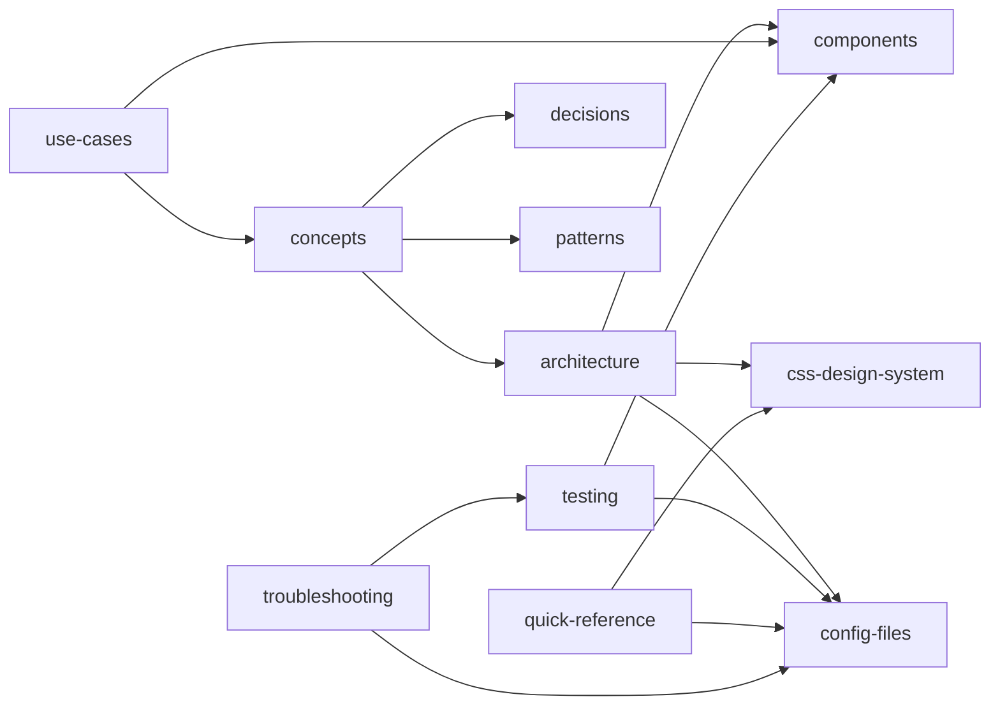

---
cssclasses: [dashboard]
tags:
  - dashboard
  - index
type: index
status: stable
---

# Documentation Dashboard

Quick navigation to all documentation areas. Use the graph view to explore connections.

## 📊 Live Overview

```dataview
TABLE type AS "Type", file.tags AS "Tags", status AS "Status"
FROM "docs"
WHERE type
SORT file.path ASC
```

## 📚 By Type

```dataview
LIST
FROM "docs"
WHERE type = "reference"
SORT file.name ASC
```
> **Reference docs** — stable, detailed reference material.

---

## 🎯 Start Here

- **New to the codebase?** Start with [[concepts]] → [[architecture]] → [[components]]
- **Looking for a specific component?** Check [[components]] or [[quick-reference]]
- **Something broken?** Check [[troubleshooting]]
- **Need to understand a decision?** Check [[decisions]]

---

## 📚 Core Documentation

| Area | Document | Description |
|------|----------|-------------|
| 🏗️ Architecture | [[architecture]] | Complete system overview |
| 📊 Diagrams | [[architecture-graph]] | Mermaid visualizations |
| 🧩 Components | [[components]] | Every file explained |
| 🎨 Design System | [[css-design-system]] | CSS tokens and classes |
| ⚙️ Configuration | [[config-files]] | Config file reference |
| 🧪 Testing | [[testing]] | Test strategy and coverage |

---

## 💡 Concepts & Patterns

| Area | Document | Description |
|------|----------|-------------|
| 🧠 Concepts | [[concepts]] | Core architectural ideas |
| 📦 Patterns | [[patterns]] | Reusable code patterns |
| 🤔 Decisions | [[decisions]] | Design decisions & trade-offs |
| 🎬 Use Cases | [[app/api-reference/adapters/use-cases]] | Real-world scenarios |

---

## 🚀 Quick Help

| Area | Document | Description |
|------|----------|-------------|
| ⚡ Quick Reference | [[quick-reference]] | Commands, tokens, patterns |
| 🔧 Troubleshooting | [[troubleshooting]] | Common issues & fixes |

---

## 📊 Knowledge Graph

This documentation is fully interconnected. In Obsidian:

1. Press `Ctrl+G` (or `Cmd+G` on Mac) to open graph view
2. See how concepts link to components, patterns, and decisions
3. Click any node to navigate

**Graph clusters:**
- **Architecture**: architecture, architecture-graph, concepts
- **Components**: components, css-design-system, testing
- **Patterns**: patterns, use-cases, decisions
- **Config**: config-files, quick-reference
- **Help**: troubleshooting, quick-reference

---

## 🗂️ File Organization

```
docs/
├── index.md              ← You are here
├── README.md             ← Documentation index
├── architecture.md       ← System architecture
├── architecture-graph.md ← Visual diagrams
├── components.md         ← Component reference
├── css-design-system.md  ← Design tokens
├── config-files.md       ← Config files
├── testing.md            ← Test strategy
├── concepts.md           ← Core concepts
├── patterns.md           ← Code patterns
├── decisions.md          ← Design decisions
├── quick-reference.md    ← Quick lookup
├── troubleshooting.md    ← Problem solving
└── app/
    └── api-reference/
        └── adapters/
            └── use-cases.md ← Real-world scenarios
```

---

## 🔗 Key Relationships



---

## 📝 Contributing

When adding new documentation:

1. Create the `.md` file in `docs/`
2. Add wiki-links `[[filename]]` to related documents
3. Update this index if it's a major addition
4. Keep last-updated dates accurate

---

*Last updated: August 2026*
