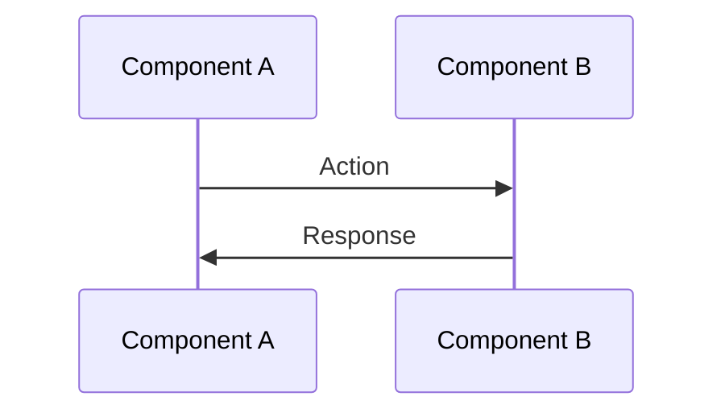

---
tags:
  - use-case
  - architecture
type: guide
status: stable
created: 2026-08-04
---

# Use Case Title

> Real-world scenario description.

**Problem:** What problem does this solve?
**Solution:** Brief description of the approach.

---

## Context

Background information about when this use case applies.

## Implementation

### Key Files

- [[file1.ts]] — Brief description
- [[file2.tsx]] — Brief description

### Flow



### Code Example

```tsx
// Implementation example
```

## Edge Cases

- Edge case 1 and how it's handled
- Edge case 2 and how it's handled

## Performance Considerations

Any performance implications or optimizations.

## Testing

How to test this use case.

## Related Use Cases

- [[Related Use Case 1]]
- [[Related Use Case 2]]

---

*Last updated: August 2026*
